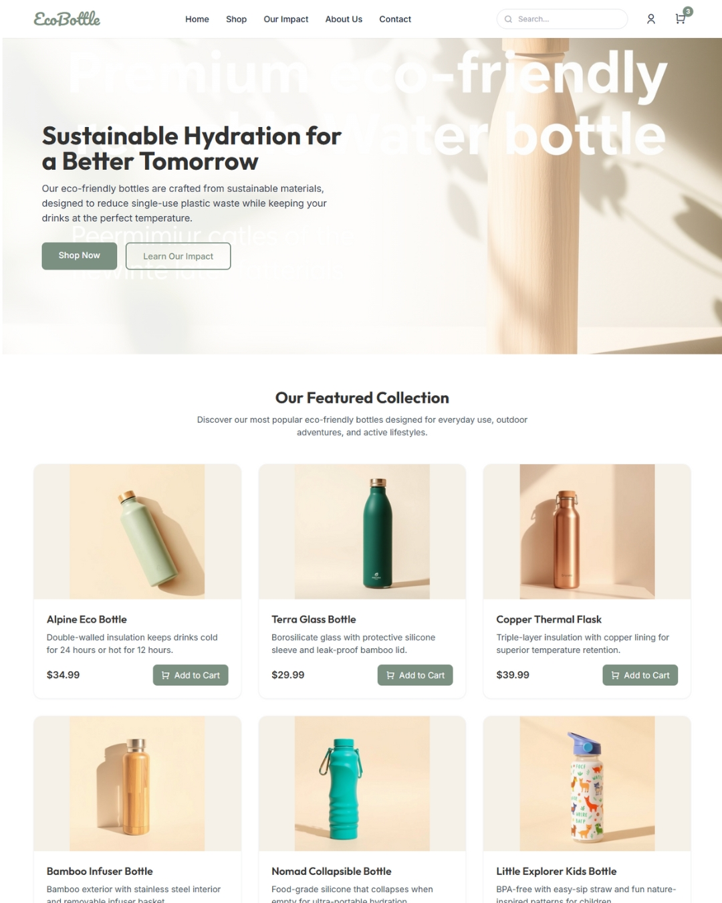

# 🌿 Ecobottle - Eco-Friendly Reusable Water Bottles

**Ecobottle** is a practice eCommerce website designed to promote and sell eco-friendly reusable water bottles. This project is built with a focus on sustainability, responsive design, and user experience.

## 🛠️ Technologies Used
- HTML5
- CSS3
- JavaScript

## 🌍 Live Demo
Check out the live version here: https://biyejidxweber.github.io/Ecobottle/

## 📸 Screenshot

*Modern, clean, and eco-focused design.*

## 📁 Features
- Responsive website for mobile and desktop
- Product listing for reusable bottles
- Clean UI/UX with eco branding
- SEO-friendly layout and structure

💡 Inspiration
This project is a part of my learning journey in web development and sustainability-driven branding.

## 📬 Contact
-Created by MD BIYEJID HOSEN

Connect with me on LinkedIn: https://www.linkedin.com/in/biyejidhosen/

Portfolio: https://rebrand.ly/BiyejidHosen

